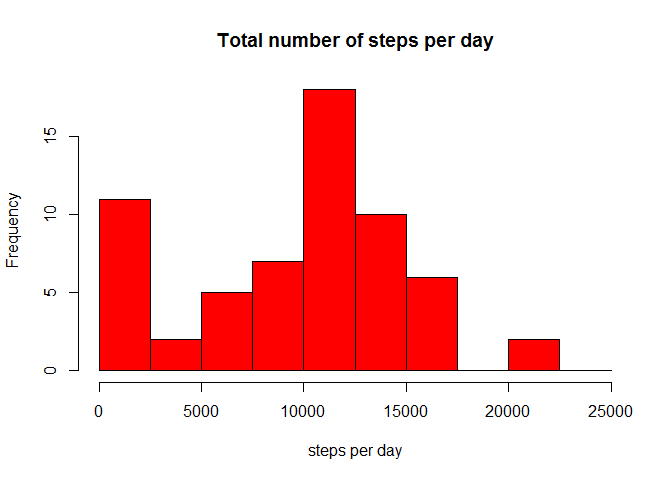
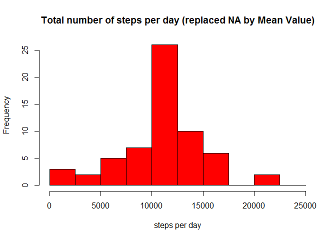
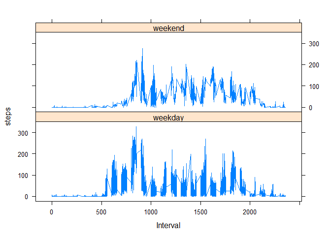

Reproducible Research: Project 1
================================

Loading and preprocessing the data
----------------------------------

#### 1. Load the data

#### 2. Process/transform the data (if necessary) into a format suitable for your analysis

      setwd("C:/Users/R_programming")
      activity_Data <- read.csv("activity.csv", colClasses = c("numeric", "character",   "integer"))

      activity_Data$date <- as.POSIXct(activity_Data$date, format="%Y-%m-%d")

What is mean total number of steps taken per day?
-------------------------------------------------

#### 1. Calculate the total number of steps taken per day

#### 2. Make a histogram of the total number of steps taken each day

#### 3. Calculate and report the mean and median of the total number of steps taken per day

      sum_by_date <- aggregate(activity_Data$steps, by=list(activity_Data$date), FUN=sum, na.rm=TRUE)
      names(sum_by_date) = c("date", "steps")

      hist(sum_by_date$steps,  breaks=seq(from=0, to=25000, by=2500), 
           main = "Total number of steps per day", xlab = "steps per day", ylab = "Frequency", col = "red") 

What is the average daily activity pattern?
-------------------------------------------

#### 1. Make a time series plot of the 5-minute interval and the average number of steps

#### 2. Which 5-minute interval, on average across all the days in the dataset, contains the maximum number of steps?

      mean_by_Interval <- aggregate(activity_Data$steps, by=list(activity_Data$interval), FUN=mean, na.rm=TRUE)
      names(mean_by_Interval) = c("Interval", "mean")

      plot(mean_by_Interval$Interval,mean_by_Interval$mean, type="l", 
           xlab="Interval", ylab="mean by steps", main="Average daily activity pattern")  

      mean_by_Interval[which.max(mean_by_Interval$mean),]

    ##     Interval     mean
    ## 104      835 206.1698

Imputing missing values
-----------------------

#### 1. Calculate and report the total number of missing values in the dataset (i.e. the total number of rows with NAs)

#### 2. Devise a strategy for filling in all of the missing values in the dataset.

#### 3. Create a new dataset that is equal to the original dataset but with the missing data filled in.

#### 4. Make a histogram of the total number of steps taken each day

      ## Calculate and report the total number of missing values in the dataset 
      sum_num_NA <- sum(is.na(activity_Data$steps))

      ## replicate mean value instead of NA by func & 
      ## Create a new dataset that is equal to the original dataset but with the missing data filled in
      func_rep_mean_for_NA <- function(steps, mean) { 
        return_para <- NA 
        if (!is.na(steps)) 
            return_para <- steps 
        else 
            return_para <- mean
        return(return_para) 
      } 

      mean_steps <- mean(activity_Data$steps, na.rm=TRUE)
      New_activity_Data <- activity_Data 
      New_activity_Data$steps <- mapply(func_rep_mean_for_NA, New_activity_Data$steps, mean_steps) 

      ## Make histagram for Total number of steps per day (replaced NA by Mean Value)
      sum_by_date_not_NA <- aggregate(New_activity_Data$steps, by=list(New_activity_Data$date),FUN=sum,na.rm=TRUE)
      names(sum_by_date_not_NA) = c("date", "steps")

      hist(sum_by_date_not_NA$steps,  breaks=seq(from=0, to=25000, by=2500), 
           main = "Total number of steps per day (replaced NA by Mean Value)", 
           xlab = "steps per day", ylab = "Frequency", col = "red") 

Are there differences in activity patterns between weekdays and weekends?
-------------------------------------------------------------------------

#### 1. Create a new factor variable in the dataset with two levels

#### 2. Make a panel plot containing a time series plot of the 5-minute interval and the average number of steps taken, averaged across all weekday days or weekend days.

      ## Add Weekday & daytype to columns

      Weektype_activity_Data <- data.frame(steps=activity_Data$steps,date=activity_Data$date,interval=activity_Data$interval,weekday=weekdays(activity_Data$date))

      Weektype_activity_Data <- cbind(Weektype_activity_Data, daytype=ifelse(Weektype_activity_Data$weekday == "saturday" | Weektype_activity_Data$weekday == "sunday" | Weektype_activity_Data$weekday == "토요일" | Weektype_activity_Data$weekday == "일요일", "weekend", "weekday"))

      ## Make divided histagrams for Weekend & Weekday
      Weektype_mean_data <- aggregate(Weektype_activity_Data$steps, by=list(Weektype_activity_Data$daytype,Weektype_activity_Data$weekday, Weektype_activity_Data$interval), FUN=mean, na.rm=TRUE)
      names(Weektype_mean_data) <- c("daytype", "weekday", "interval", "mean")

      library(lattice)
      xyplot(mean ~ interval | daytype, Weektype_mean_data, type="l", lwd=1, xlab="Interval",
             ylab="steps", layout=c(1,2))

